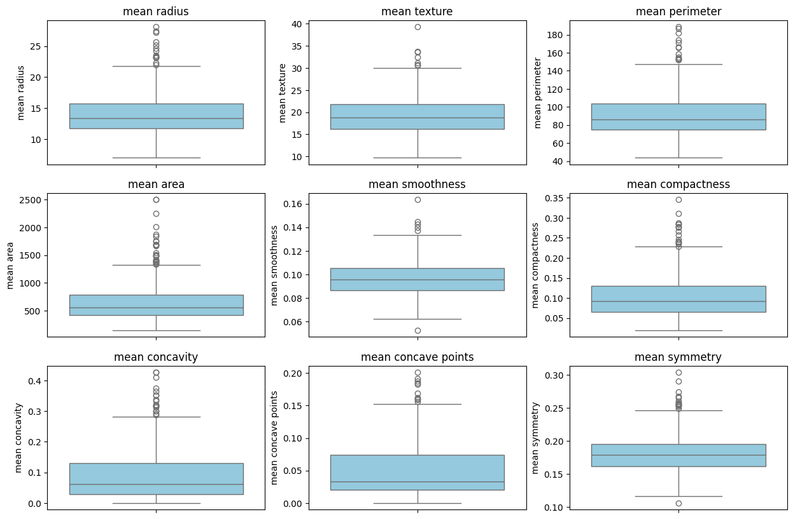
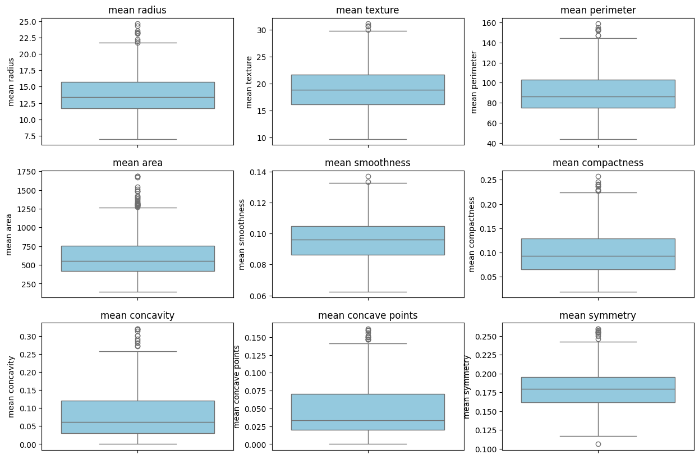
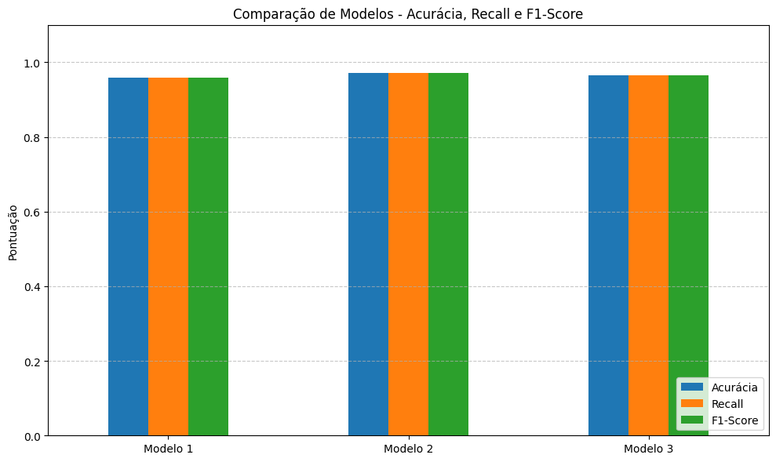
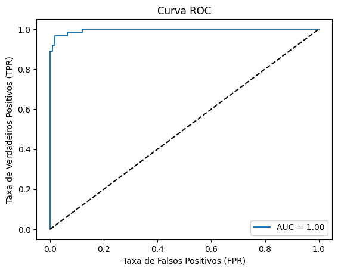

# Classificação de Câncer de Mama com Random Forest

Este projeto aplica o algoritmo de classificação Random Forest para prever o diagnóstico de câncer de mama, distinguindo entre tumores benignos e malignos. O objetivo principal é demonstrar técnicas de pré-processamento, ajuste de hiperparâmetros e avaliação de modelos utilizando métricas adequadas de performance.

---

## Objetivos do Projeto

- Aplicar técnicas de Machine Learning supervisionado para diagnóstico médico.
- Realizar pré-processamento de dados com tratamento de outliers e normalização.
- Comparar diferentes configurações de hiperparâmetros no modelo Random Forest.
- Avaliar o desempenho do modelo utilizando métricas como Acurácia, Precision, Recall, F1-Score e ROC-AUC.
- Validar a robustez do modelo com validação cruzada.

---

## Conjunto de Dados

O dataset utilizado é fornecido pela biblioteca `sklearn.datasets`, contendo informações sobre características morfológicas de células tumorais, extraídas de imagens digitalizadas de exames.

---

## Pré-processamento

- **Tratamento de Outliers:** realizado com base no Z-Score.
- **Normalização:** aplicada com MinMaxScaler para uniformizar a escala dos atributos.
- **Divisão de Dados:** os dados foram divididos em 70% para treino e 30% para teste.

Sem tratamento de Outliers

Com tratamento de Outliers

---

## Modelo de Classificação

O algoritmo Random Forest foi escolhido por sua robustez e capacidade de generalização. Foram testadas três configurações diferentes de hiperparâmetros:

| Modelo | Árvores (`n_estimators`) | Profundidade (`max_depth`) | Min. Amostras por Folha (`min_samples_leaf`) |
|--------|---------------------------|-----------------------------|----------------------------------------------|
| Modelo 1 | 100 | 10 | 2 |
| Modelo 2 | 120 | 12 | 3 |
| Modelo 3 | 75  | 8  | 2 |

---

## Avaliação dos Modelos

As métricas utilizadas para avaliação foram:

- **Acurácia:** proporção de acertos totais.
- **Precision:** taxa de acerto entre as previsões positivas.
- **Recall (Sensibilidade):** taxa de acerto sobre todos os positivos reais.
- **F1-Score:** média harmônica entre precision e recall.
- **ROC-AUC:** área sob a curva ROC, que mostra a capacidade do modelo em separar classes.

### Comparação de Desempenho

*Gráfico de comparação das métricas Acurácia, Recall e F1-Score:*

---

## Curva ROC e AUC

A Curva ROC foi gerada para todos os modelos, permitindo visualizar o equilíbrio entre a taxa de verdadeiros positivos e a taxa de falsos positivos. O valor de AUC (Área sob a curva) foi superior a **0.99** em todas as configurações, demonstrando excelente desempenho na separação das classes.

> 

---

## Validação Cruzada

A técnica de validação cruzada (`cross_val_score`) foi aplicada com 5 folds utilizando a métrica `roc_auc`. Os resultados mostraram consistência na performance do modelo com uma AUC média de **0.9915**, reforçando a confiabilidade do Random Forest mesmo com diferentes divisões de dados.

---

## Conclusão

O projeto demonstrou que o algoritmo Random Forest é altamente eficaz na tarefa de classificação binária aplicada ao diagnóstico de câncer de mama. Mesmo com ajustes simples de hiperparâmetros, o modelo apresentou acurácias acima de 95% e um excelente desempenho segundo a métrica ROC-AUC. A normalização dos dados, o tratamento de outliers e a validação cruzada foram fatores determinantes para o sucesso do modelo, garantindo robustez e capacidade de generalização.

---
